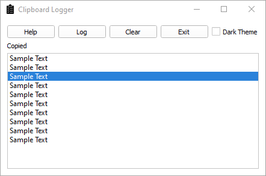

# Simple Clipboard application in python

## Introduction
This application let's you store your copied texts to use it later

  

## Installing

At first you need to open up your Terminal window in the application folder, then type the following command it will install the components that it requires.

To install, on windows, type this into a command prompt:

    pip install -r requirements.txt

## Running the program

After your pip install, open the <code>*clipBoard.pyw* </code> file.
